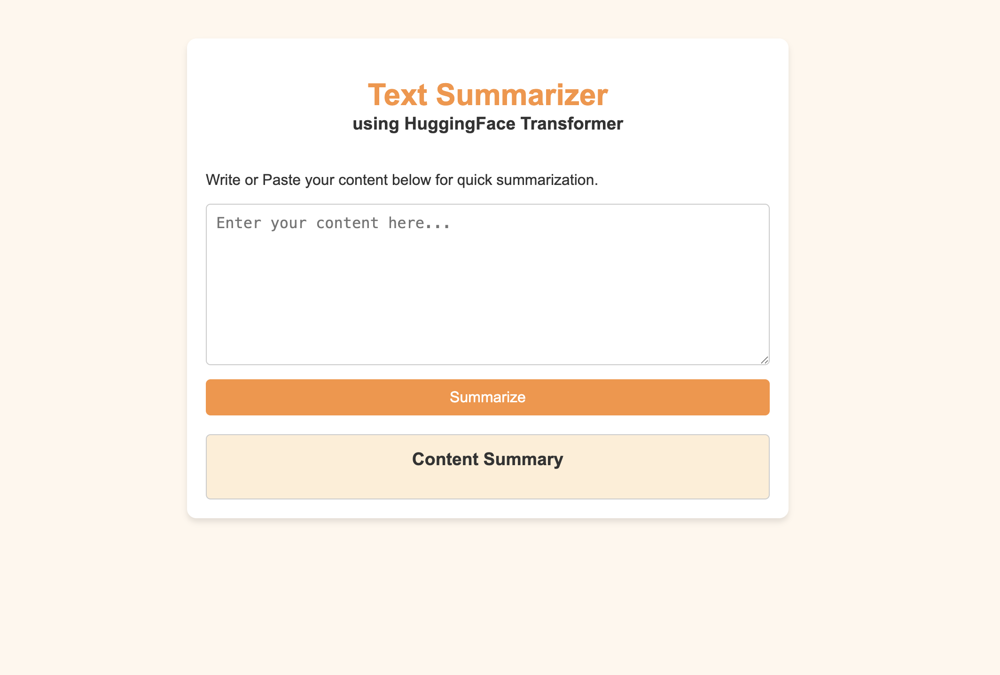

<div align="center">

# 📝 Text Summarizer

### *Turning walls of text into bite-sized insights — powered by T5 & 🤗 Transformers*

[](https://www.python.org/)
[](https://fastapi.tiangolo.com/)
[](https://huggingface.co/docs/transformers)
[](https://pytorch.org/)
[](#-license)

</div>

<br>

<div align="center">
  
  <p><em>The Text Summarizer web app in action ✨</em></p>
</div>

<br>

## 📖 About

**Text Summarizer** is an end-to-end NLP project that fine-tunes a **T5 (Text-to-Text Transfer Transformer)** model to generate concise, meaningful summaries from long-form dialogue and text. The trained model is served through a lightweight **FastAPI** backend with a clean, minimal web UI — so anyone can paste in text and get an instant summary in their browser.

Everything from data preprocessing and model fine-tuning to deployment is included, making this a complete showcase of a real-world NLP pipeline.

> 💡 Built as a hands-on project to explore fine-tuning transformer models for abstractive summarization and shipping them behind a usable API + UI.

<br>

## ✨ Features

- 🧠 **Fine-tuned T5 model** for abstractive text/dialogue summarization
- ⚡ **FastAPI backend** exposing a simple, fast `/summarize/` REST endpoint
- 🎨 **Minimal, aesthetic web UI** — paste your text and summarize with one click
- 🧹 **Built-in text cleaning pipeline** (whitespace, HTML tags, line breaks) before inference
- 🖥️ **Automatic device selection** — runs on CUDA, Apple MPS, or CPU, whichever is available
- 📓 **Jupyter Notebook** walking through data prep, fine-tuning, and evaluation end-to-end

<br>

## 🛠️ Tech Stack

| Layer            | Technology                                   |
|-------------------|-----------------------------------------------|
| Model             | T5 (`T5ForConditionalGeneration`, `T5Tokenizer`) via 🤗 Transformers |
| Training          | PyTorch, Jupyter Notebook                     |
| Backend / API     | FastAPI + Uvicorn                             |
| Frontend          | Jinja2 templates, HTML/CSS/JS                 |
| Data              | Dialogue summarization dataset (`/Dataset`)   |

<br>

## 📂 Project Structure

```
Text-Summarizer/
├── Dataset/                 # Training/evaluation data
├── app.py                   # FastAPI app — model loading, cleaning, /summarize/ endpoint
├── index.html                # Frontend UI served by the FastAPI app
├── text_summarizer.ipynb    # Notebook: data prep, T5 fine-tuning, evaluation
├── saved_summary_model/     # Fine-tuned model + tokenizer (generated after training)
└── README.md
```

<br>

## 🚀 Getting Started

### 1. Clone the repo

```bash
git clone https://github.com/ravihw7/Text-Summarizer.git
cd Text-Summarizer
```

### 2. Install dependencies

```bash
pip install fastapi uvicorn torch transformers jinja2 python-multipart
```

### 3. Train / obtain the model

Run through `text_summarizer.ipynb` to fine-tune T5 on the dataset in `Dataset/` and export the trained weights to a `saved_summary_model/` folder (this is what `app.py` loads at startup).

### 4. Launch the app

```bash
uvicorn app:app --reload
```

Then open **http://127.0.0.1:8000** in your browser, paste in some text, and hit **Summarize** 🎉

<br>

## 🔌 API Usage

The app also exposes a simple REST endpoint for programmatic access:

```bash
curl -X POST "http://127.0.0.1:8000/summarize/" \
  -H "Content-Type: application/json" \
  -d '{"dialogue": "Paste your long text or conversation here..."}'
```

**Response:**

```json
{
  "summary": "A concise, generated summary of the input text."
}
```

<br>

## 🧠 How It Works

1. Input text is cleaned (line breaks, extra whitespace, and HTML tags stripped, then lowercased)
2. The cleaned text is tokenized and padded/truncated to a fixed length
3. The fine-tuned T5 model generates a summary using **beam search** (`num_beams=4`) with early stopping
4. The generated tokens are decoded back into readable text and returned to the user

<br>

## 🗺️ Roadmap

- [ ] Add support for longer documents via chunking
- [ ] Deploy a live demo (Render / HuggingFace Spaces)
- [ ] Add summary length control in the UI
- [ ] Model evaluation metrics (ROUGE) in the README

<br>

## 🤝 Contributing

Contributions, issues, and feature requests are welcome! Feel free to check the [issues page](https://github.com/ravihw7/Text-Summarizer/issues) or open a PR.

<br>

## 📄 License

This project is open source and available under the [MIT License](LICENSE).

<br>

## 👤 Author

**Ravi**
- GitHub: [@ravihw7](https://github.com/ravihw7)

<div align="center">
<br>

⭐ If you found this project useful, consider giving it a star!

</div>
